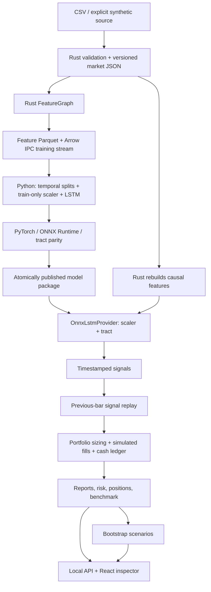

# Codebase walkthrough and verification

Audited 2026-09-28 at commit **1f1d718**, on main. The requested comparison baseline is **3dcca43**. This document describes inspected source and tests; historical roadmap statements are identified separately. No implementation changes were made for this explanation.

## 1. What the system currently is

This is a local, artifact-driven quantitative research application. It can ingest supplied daily OHLCV data, construct technical features, train a return forecaster, export a validated model, run native Rust inference, simulate trading, and expose recorded evidence through a browser inspector.

Its central separation is between **learning a predictor** and **evaluating what trading that predictor would do**. A forecast is not an order; an order is not a fill; a fill is not profit; a profitable historical path is not evidence of future profitability.

The authoritative entry point is [quantctl main](<C:/Users/Sahil/OneDrive/Documents/Desktop/lstm/lstm_stock_prediction/rust/cli/src/main.rs:14>); [Commands](<C:/Users/Sahil/OneDrive/Documents/Desktop/lstm/lstm_stock_prediction/rust/cli/src/commands.rs:29>) defines actual syntax. Several commands shown in the old handover are obsolete.

Three corrections to the old narrative:

- Rust uses **tract-onnx**, whereas Python uses **ONNX Runtime** to verify export.
- The shared baseline feature graph has **eight scalar features**, not nine.
- Backtests now use genuine ONNX predictions. The CLI precomputes them and passes them through ManualSignalStream; the ModelSignalStream type is available but is not the current CLI route.

## 2. Component inventory

| Component | One-sentence purpose | Current integration |
|---|---|---|
| quant_config | Parse YAML, apply environment overrides, and reject invalid settings. | Used by operational handlers; resolved configuration is passed to Python. |
| quant_instruments | Define stable instrument identities and asset metadata. | Equity workflow; Future and Option_ are type scaffolding. |
| quant_calendar | Represent US equity holidays, sessions, daylight saving and early closes. | Library/provider support; CSV ingestion does not certify session completeness. |
| quant_data | Acquire, validate, version, persist and verify OHLCV bars. | Local CSV default; synthetic explicit; Yahoo explicitly gated. |
| quant_features | Turn chronological bars into features and supervised datasets. | Eight-feature baseline active; advanced feature libraries optional. |
| Python dataset/splits | Load the Arrow contract and enforce chronological training boundaries. | Active training path. |
| Python model/trainer | Fit an LSTM to forward log returns. | Single-horizon default; multi-horizon research implementation separate. |
| Python export/publication | Export, numerically verify and publish complete model packages. | Active, including mandatory Rust parity. |
| quant_inference | Load verified model bytes and apply a fixed scaler before tract inference. | Active predict and backtest route. |
| quant_signals | Translate forecasts into direction, strength and provenance. | Default calibrator active; extra transforms partially integrated. |
| quant_portfolio | Convert signals into target holdings and maintain cash/positions. | Volatility-targeted constructor active; Kelly/QP optional. |
| quant_execution | Convert desired orders into simulated fills with costs and liquidity caps. | Composite bar model active; nonlinear impact/variable fees optional. |
| quant_risk | Describe portfolio exposure and return-based risk. | Post-replay risk artifact; not an independent pre-trade veto layer. |
| quant_backtest | Replay timestamped signals through sizing, fills and accounting. | Real model-driven, single-symbol daily-bar workflow. |
| quant_simulation | Resample strategy returns and provide regime-related utilities. | Bootstrap CLI active; regime guardrails not wired into replay. |
| quant_api + web | Browse persisted models, runs, validation, signals and risk evidence. | Read-only local inspector. |
| quantctl + CI | Provide reproducible commands, benchmarks and automated checks. | CI implemented; automated live deployment absent. |

The Rust workspace contains 14 members in [workspace configuration](<C:/Users/Sahil/OneDrive/Documents/Desktop/lstm/lstm_stock_prediction/rust/Cargo.toml:1>); Python ML is under [train_and_export](<C:/Users/Sahil/OneDrive/Documents/Desktop/lstm/lstm_stock_prediction/python/ml/train_orchestrator.py:137>). The archived Python prototype has its own environment and is not the active pipeline.

## 3. Data ingestion, storage and point-in-time meaning

**Purpose:** obtain structurally valid observations whose identity and bytes can be traced later.

The path is:
quantctl data ingest → handle_data → selected MarketDataProvider::fetch_ohlcv → validation → write_dataset.

[handle_data](<C:/Users/Sahil/OneDrive/Documents/Desktop/lstm/lstm_stock_prediction/rust/cli/src/handlers/data.rs:13>) selects LocalCsvProvider, YfinanceAdapter or SyntheticDataProvider from configuration. No silent switch to synthetic data occurs on acquisition failure.

[parse_local_csv](<C:/Users/Sahil/OneDrive/Documents/Desktop/lstm/lstm_stock_prediction/rust/data/src/adapters/local_csv.rs:22>) requires the exact header timestamp,open,high,low,close,volume. It parses explicit RFC3339 timezones into UTC nanoseconds, requires integer nonnegative volume, validates the entire input before date filtering, and uses an exclusive end date. The format is deliberately simple comma-separated numeric data, not a general quoted-CSV implementation.

[validate_bars_monotonic_and_sound](<C:/Users/Sahil/OneDrive/Documents/Desktop/lstm/lstm_stock_prediction/rust/data/src/validate.rs:9>) rejects nonincreasing timestamps, nonfinite or nonpositive prices, high below low/open/close, and low above open/close. Duplicate checking is explicit as well. These checks detect malformed observations; they cannot certify vendor accuracy, historical universe membership or correct split adjustment.

[write_dataset](<C:/Users/Sahil/OneDrive/Documents/Desktop/lstm/lstm_stock_prediction/rust/data/src/storage.rs:44>) writes:
- datasets/market/<dataset_version>/<symbol>.json: serialized bars.
- A sibling manifest containing source, symbol, dates, count and SHA-256.

It uses create-new semantics, refuses ordinary overwrites, and publishes the manifest last. [read_dataset](<C:/Users/Sahil/OneDrive/Documents/Desktop/lstm/lstm_stock_prediction/rust/data/src/storage.rs:105>) verifies identity, content hash, count and bar validity again. A crash can leave an incomplete version; this is not a single atomic transaction covering all files.

[Bar](<C:/Users/Sahil/OneDrive/Documents/Desktop/lstm/lstm_stock_prediction/rust/data/src/types.rs:45>) distinguishes observation timestamp from availability_timestamp. Conceptually, an event can happen at 16:00 but only reach your system at 16:00:02. At 16:00:01 it is unavailable, despite its event timestamp.

**Current limit:** the operational FeatureGraph and replay index bars by timestamp, not availability_timestamp. CSV uses Bar::same_bar, making them equal and relying on the importer to supply actual availability time. The generic [check_feature_target_leakage](<C:/Users/Sahil/OneDrive/Documents/Desktop/lstm/lstm_stock_prediction/rust/data/src/validate.rs:94>) helper exists and is tested, but is not wired into the full feature/export/replay path. Its implementation permits equality and rejects availability strictly after the supplied target boundary. Do not describe this as comprehensive asynchronous event-time PIT enforcement.

[adjust_bars_pit](<C:/Users/Sahil/OneDrive/Documents/Desktop/lstm/lstm_stock_prediction/rust/data/src/adjust.rs:11>) applies only actions effective by a supplied as_of date: splits rescale prices/volume and dividends subtract an offset. It is a library helper, not an invoked CSV ingestion stage. CorporateAction records an effective date, not announcement/revision history. Local CSV corporate-action acquisition returns an explicit unsupported error. Correct historical adjustment remains an input responsibility.

The Yahoo exception also means “Python only does ML” is an architectural intention with a qualified acquisition exception: [data_fetch_helper](<C:/Users/Sahil/OneDrive/Documents/Desktop/lstm/lstm_stock_prediction/python/ml/data_fetch_helper.py:14>) can call yfinance when QUANTCTL_ALLOW_NETWORK=1. Rust and Python both deny that acquisition otherwise. yfinance is not listed among the core ML dependencies.

## 4. Feature graph, store and Arrow handoff

**Purpose:** express market history as consistently ordered numeric inputs and future labels.

quantctl features build → handle_features → pipeline::bars → pipeline::graph → FeatureGraph::compute_batch → Parquet features and Arrow training export.

The active definitions are in [pipeline::graph](<C:/Users/Sahil/OneDrive/Documents/Desktop/lstm/lstm_stock_prediction/rust/cli/src/handlers/pipeline.rs:11>):

| Exported column | Computation and interpretation |
|---|---|
| sma | SMA(20): average recent closing price; trend level. |
| ema | EMA(12): more weight on recent closes; responsive trend level. |
| rsi | RSI(14): relative smoothed gains versus losses; bounded momentum. |
| macd | MACD(12,26,9) histogram: fast/slow trend difference minus its signal average. |
| bollinger_bandwidth | Bollinger(20,2) width divided by mean; relative price dispersion. |
| atr | ATR(14): smoothed maximum of range and previous-close gaps. |
| rolling_volatility | Sample standard deviation of 20 log returns, annualized by sqrt(252). |
| log_return | ln(close_t / close_(t-1)); the last observed return. |

The graph is a vector of Feature implementations evaluated against a shared BarWindow, not a general dependency-scheduled DAG. [push_bar](<C:/Users/Sahil/OneDrive/Documents/Desktop/lstm/lstm_stock_prediction/rust/features/src/graph.rs:68>) adds only the next chronological bar, computes each feature and emits a FeatureRow only when all features are ready. [compute_batch](<C:/Users/Sahil/OneDrive/Documents/Desktop/lstm/lstm_stock_prediction/rust/features/src/graph.rs:86>) repeatedly calls that streaming primitive. MACD sets the largest lookback to 35 bars, so the first fully populated baseline row appears on bar 35.

The LSTM lookback is a different quantity. With 60 feature rows required, the first complete model window needs 35 + 60 - 1 = 94 raw bars. With a one-bar future target, training also needs bar 95 to label that first window.

Several indicators rebuild temporary vectors and recompute EMA/Wilder smoothing over the bounded window. They are causal, but not universally constant-time or zero-allocation, and their finite-window seeding need not match an indefinitely stateful vendor indicator. Use this implementation consistently for training and prediction.

[FeatureStore](<C:/Users/Sahil/OneDrive/Documents/Desktop/lstm/lstm_stock_prediction/rust/features/src/store.rs:25>) holds symbol → timestamp → FeatureRow maps behind Arc/RwLock and supports range/recent queries and schema registration. Parquet persistence lives in FeatureArrowExporter; the store itself is not a database service. The active predict command rebuilds features from market bars rather than querying the persisted Parquet files.

[TargetGenerator::compute_targets](<C:/Users/Sahil/OneDrive/Documents/Desktop/lstm/lstm_stock_prediction/rust/features/src/targets.rs:65>) computes y_t = ln(close_(t+h)/close_t), plus an up/neutral/down label. Future prices belong exclusively to target construction. Trailing bars without a realized target are omitted from supervised data.

[write_training_ipc](<C:/Users/Sahil/OneDrive/Documents/Desktop/lstm/lstm_stock_prediction/rust/features/src/export.rs:159>) joins feature and target rows by the feature timestamp, sorts feature columns, and writes:
- timestamp and target_timestamp as int64 nanoseconds.
- target and feature values as float32.
- asset_id, feature_set_version and target_horizon.
- A hashed manifest binding the Arrow bytes to the source market-data hash.

The active exporter assigns asset_id=1 in each per-symbol file. This is consistent with the single-symbol workflow, not a complete global asset catalog.

**Why Arrow:** it provides a typed, language-independent columnar contract instead of duplicating indicator calculations in Python. Explicit types and feature order remove ambiguity at the language boundary. The format supports efficient buffer interchange, but this loader reads the stream, converts to pandas/NumPy and allocates sliding windows. This implementation is not zero-copy end to end. Training files use IPC stream format; MmapArrowReader expects IPC file metadata and is not the reader for those training streams. See [load_arrow_training_dataset](<C:/Users/Sahil/OneDrive/Documents/Desktop/lstm/lstm_stock_prediction/python/ml/arrow_dataset.py:37>), [MmapArrowReader::open](<C:/Users/Sahil/OneDrive/Documents/Desktop/lstm/lstm_stock_prediction/rust/features/src/mmap_reader.rs:60>), and the [Arrow format specification](https://arrow.apache.org/docs/format/Columnar.html).

Additional libraries implement Parkinson/Garman–Klass range volatility, fractional differencing, cross-sectional standardization/winsorization, SIMD helpers and memory mapping. They are not automatically enabled by baseline_v1. Fractional differencing forms a weighted lag sum to reduce persistence while retaining more memory than first differencing; it does not itself prove stationarity. Cross-sectional z-scores compare assets observed at the same time, requiring an aligned universe that the current single-symbol CLI does not supply.

## 5. Training, leakage prevention and walk-forward evaluation

**Purpose:** learn from past observations while keeping later labels and scaling statistics outside model fitting.

[handle_train](<C:/Users/Sahil/OneDrive/Documents/Desktop/lstm/lstm_stock_prediction/rust/cli/src/handlers/train.rs:9>) loads and validates YAML plus QUANTCTL_* overrides, enforces one symbol, writes the resolved configuration to a temporary YAML, selects the Python interpreter, and launches train_orchestrator.py. It sets QUANTCTL_EXECUTABLE so Python can invoke native parity and provenance checks.

[load_arrow_training_dataset](<C:/Users/Sahil/OneDrive/Documents/Desktop/lstm/lstm_stock_prediction/python/ml/arrow_dataset.py:37>) requires a hashed manifest, checks bytes, columns, row count, feature names, increasing timestamps, finite inputs/targets, future target timestamps, and one feature-set version/horizon.

[train_and_export](<C:/Users/Sahil/OneDrive/Documents/Desktop/lstm/lstm_stock_prediction/python/ml/train_orchestrator.py:137>) then:
1. Seeds NumPy/PyTorch.
2. Loads arrays and preserves schema, timestamps, horizon and provenance.
3. Splits chronologically.
4. Uses purge_gap=max(target_horizon, configured purge_gap).
5. Rejects any train label extending into validation, or validation label extending into test.
6. Fits FeatureScaler only on raw training rows.
7. Applies unchanged training statistics to validation/test.
8. Creates windows separately inside each split.
9. Trains LSTMForecaster with AdamW and DirectionalAsymmetricLoss.
10. Restores best validation weights, evaluates held-out predictions and exports.

For T rows, F features and lookback L, create_sliding_windows produces X with shape [T-L+1,L,F] and y from the last row in each window. Training batches may shuffle these already-safe windows; chronology inside each window and membership in the outer splits remain unchanged.

The [FeatureScaler](<C:/Users/Sahil/OneDrive/Documents/Desktop/lstm/lstm_stock_prediction/python/ml/dataset.py:94>) uses training mean and population standard deviation, replacing near-zero standard deviations with 1. This prevents a constant feature from causing division by zero.

**What leakage looks like:** if an input at day 100 has a five-day target, its label needs day 105. A train/test boundary at day 102 cannot safely retain that label in training. Removing shared row indices alone is insufficient; the label information interval crosses the boundary.

Purging removes rows close enough to a boundary for labels to overlap. Embargo adds a buffer to reduce dependence near the boundary. Here [PurgedWalkForwardSplitter](<C:/Users/Sahil/OneDrive/Documents/Desktop/lstm/lstm_stock_prediction/python/ml/dataset.py:8>) removes rows before and after chronological cut points; it is not a full combinatorial purged CV implementation. Direct timestamp checks are stronger than merely trusting the requested gap.

Fitting a scaler across all dates is another leakage route: future distribution changes influence even early normalized features. Splitting before windowing and fitting prevents that.

For N=1000, train_ratio=.6, val_ratio=.2, purge=10 and embargo=25, the actual index ranges are train [0,590), validation [625,790), test [825,1000). The gaps are unused. This is an example of the splitter, not the default config.

**Default single holdout:** raw proportions are 70/15/15 before gaps and window warmup. Each resulting split must contain at least lookback+1 rows. Default config uses lookback 60, purge 5 and embargo 60.

**Walk-forward mode:** quantctl train --walk-forward --folds N calls [WalkForwardCV::split](<C:/Users/Sahil/OneDrive/Documents/Desktop/lstm/lstm_stock_prediction/python/ml/walk_forward.py:27>) with rolling windows. Each outer development block is split again into train and validation, with gaps; each fold trains a fresh model and scaler. Published fold directories contain their own weights, parity and OOS predictions. Pooled prediction metrics combine held-out predictions across folds.

The root model is a copy of the **final fold** with root identity updated; root replay periods are the final fold's periods. There is no calendar-quarter scheduler, automatic model activation/rotation or stitched multi-fold trading equity curve. Equal sample-count blocks are not calendar quarters. A later fold may learn from an earlier fold's test dates after they become historical; that is legitimate walk-forward learning, provided model selection does not use future outcomes.

**Concrete coverage:** [dataset leakage tests](<C:/Users/Sahil/OneDrive/Documents/Desktop/lstm/lstm_stock_prediction/python/tests/test_dataset_leakage.py:1>) test disjoint/gapped splits, target/window alignment and train-only scaler fitting. [walk-forward tests](<C:/Users/Sahil/OneDrive/Documents/Desktop/lstm/lstm_stock_prediction/python/tests/test_walk_forward_orchestration.py:1>) train three synthetic folds, verify gaps, recompute fold scaler means from the correct rows and require successful Rust parity. [PIT property tests](<C:/Users/Sahil/OneDrive/Documents/Desktop/lstm/lstm_stock_prediction/rust/data/tests/pit_property_tests.rs:1>) exercise duplicate/nonmonotonic timestamps and future-availability rejection. Those helper tests do not prove the full pipeline propagates delayed availability.

## 6. LSTM mechanism and model choice

**Purpose:** compress an ordered feature window into a predicted future log return.

The actual [LSTMForecaster](<C:/Users/Sahil/OneDrive/Documents/Desktop/lstm/lstm_stock_prediction/python/ml/models/lstm.py:8>) is:
[B,L,F] → stacked unidirectional nn.LSTM → final time-step hidden vector → LayerNorm → Linear(H,H/2) → GELU → Dropout → Linear(H/2,1).

The current YAML requests L=60, H=128, two recurrent layers, dropout=.3, batch size 64 and 50 maximum epochs. The graph emits F=8. Those configuration defaults supersede different fallback values in Python class constructors.

For an individual time step, the modern LSTM cell maintains hidden output h and memory c:
- Forget gate f chooses which old memory components to preserve.
- Input gate i chooses how much newly proposed memory g to write.
- Memory updates as c_t = f_t * c_(t-1) + i_t * g_t.
- Output gate o exposes h_t = o_t * tanh(c_t).

The gates are learned functions of the current feature vector and previous hidden state. This provides an additive memory path that helps preserve gradients over time. It does not identify economic regimes by itself. See [PyTorch's LSTM equations](https://docs.pytorch.org/docs/2.14/generated/torch.nn.LSTM.html) and [Hochreiter and Schmidhuber's original paper](https://www.bioinf.jku.at/publications/older/2604.pdf).

_init_weights uses Xavier input weights, orthogonal recurrent weights and positive forget biases. Both PyTorch bias tensors receive +1 in the forget slice, so their summed initial forget bias is +2. The “residual projection head” docstring is imprecise: forward has no explicit skip connection around its head.

Why choose it? My architectural interpretation is that an LSTM supplies an ordered-sequence inductive bias with a compact hidden state and a conventional training/export route. A flattened feedforward network can use lags too, but does not inherently reuse a recurrent transition. Transformers can model long-range interactions and parallelize training, with different data/compute tradeoffs. The repository contains no controlled experiment proving an LSTM beats either alternative on these returns.

[ModelTrainer](<C:/Users/Sahil/OneDrive/Documents/Desktop/lstm/lstm_stock_prediction/python/ml/trainer.py:10>) runs gradient descent, clips gradient norm to 1, supports an optional scheduler, keeps the best validation state and early-stops after five unimproved epochs in the orchestrator. AdamW supplies weight decay. The default orchestrator supplies no scheduler.

[DirectionalAsymmetricLoss](<C:/Users/Sahil/OneDrive/Documents/Desktop/lstm/lstm_stock_prediction/python/ml/loss.py:8>) is Huber regression loss multiplied by 2 when predicted and realized signs disagree. This favors directional consistency while retaining magnitude error. It still does not optimize actual transaction-cost-adjusted P&L.

MultiHorizonLSTMForecaster shares an LSTM representation across heads for horizons such as 1/5/20. MultiHorizonLoss, SharpeAwareLoss, SortinoAwareLoss and ConformalPredictor are separate research components, not the default orchestrator/provider contract. The Rust session currently consumes the first output scalar; changing to multi-horizon production inference requires an explicit output schema and new replay/parity coverage.

ConformalPredictor calibrates residual quantiles, optionally scaled by sigmas, and produces bands. Its usual finite-sample interpretation requires exchangeability or a justified extension for dependence/shift; arbitrary financial drift does not retain unconditional coverage merely because the method is called distribution-free. The default adaptive calibration also substitutes residual magnitudes when sigmas are omitted, which deserves validation before operational use. See [the conformal prediction introduction](https://arxiv.org/html/2107.07511v6).

## 7. Evaluation metrics and what they do not establish

[compute_metrics](<C:/Users/Sahil/OneDrive/Documents/Desktop/lstm/lstm_stock_prediction/python/ml/evaluate.py:58>) reports:
- Pearson IC = correlation(predicted return, realized return): linear forecasting association.
- Rank IC = Spearman correlation: ordering association, less dependent on precise forecast scale.
- Directional accuracy: proportion of nonzero actual returns whose sign was forecast correctly.
- Annualized Sharpe, drawdown, mean return and volatility of a **proxy strategy**.

That proxy uses position=tanh(prediction), strategy_return=position*target, then compounds 1+strategy_return. It excludes the real backtest's fees, fills, constraints and rebalance timing. Targets are log returns; treating their product with exposure as simple strategy returns is an approximation. Multi-bar overlapping targets and hardcoded 252 annualization further limit economic interpretation.

For actual strategy bar returns r, the Rust backtest computes Sharpe approximately as sqrt(252)*(mean(r)-annual_risk_free/252)/sample_std(r). It asks how much excess return was obtained per unit of variability. Drawdown measures the largest decline from a prior equity peak; Sortino uses downside dispersion; turnover measures trading notional relative to initial capital.

These complement MSE and accuracy. A zero-return predictor may have a small MSE in a noisy series but no useful trading information. Correct signs on many tiny moves can coexist with catastrophic mistakes on a few large moves. IC addresses forecast relation; Sharpe addresses the result of turning a forecast into positions, subject to execution assumptions.

In the active single-symbol workflow, IC is computed across time; it is not a daily cross-sectional stock-ranking IC. None of these metrics alone supplies statistical significance or a successful multiple-testing correction.

[BacktestReport::compute](<C:/Users/Sahil/OneDrive/Documents/Desktop/lstm/lstm_stock_prediction/rust/backtest/src/report.rs:65>) includes further qualifications:
- Sharpe uses sample variance; Python uses population variance.
- The “deflated Sharpe” field subtracts a heuristic 0.15*sqrt(log(trials)); it is not the full published significance calculation. The CLI passes trials=1, so this penalty is zero.
- Profit factor is capped to the sentinel 10 when profitable closes have no losses.
- total_trades counts fills; hit rate counts profitable closing events, a different denominator.
- Daily annualization assumes 252 observations per year.

## 8. Export, publication, model versioning and native inference

**Purpose:** make the model's learned behavior portable, traceable and checked at the language boundary.

[export_to_onnx](<C:/Users/Sahil/OneDrive/Documents/Desktop/lstm/lstm_stock_prediction/python/ml/export_onnx.py:25>) switches the model to evaluation mode, exports ONNX opset 17 with constant folding and dynamic batch axis, checks graph validity, attaches metadata and executes it in Python ONNX Runtime. Sequence length is fixed for an artifact.

The full training package includes model.onnx, model.pt, scaler.json, metadata.json, training_log.json and validation.json. The orchestrator also writes OOS predictions and fold records. Metadata binds feature order, lookback, architecture, target horizon, data version, seed, training periods and source provenance.

[staged_model](<C:/Users/Sahil/OneDrive/Documents/Desktop/lstm/lstm_stock_prediction/python/ml/publication.py:71>) reserves a model ID, creates a same-filesystem staging directory, validates required files and successful parity evidence, hashes the six mandatory files into integrity.json, then renames the directory into its final path. Existing model IDs are rejected. Exceptions clean staged attempts; abrupt termination can leave a lock requiring recovery. The integrity file seals six core members, not arbitrary extra files recursively. OOS/fold digests are recorded separately; the provider's core verifier is not a recursive evidence validator.

Why keep all this? Weights alone cannot reproduce a forecast without the identical feature order, scaler, lookback, target definition and data/code lineage. Versioned artifacts make experiment comparisons meaningful and detect accidental replacement. SHA-256 protects consistency against a recorded manifest; unsigned hashes do not authenticate a maliciously replaced package.

There are two distinct numerical checks:
1. Python compares a held-out PyTorch output with ONNX Runtime, requiring finite maximum absolute error <=1e-5.
2. Saved raw feature windows are sent through quantctl verify-model → [verify_runtime_parity](<C:/Users/Sahil/OneDrive/Documents/Desktop/lstm/lstm_stock_prediction/rust/inference/src/parity.rs:15>). Rust applies its scaler and tract, comparing against PyTorch references at <=1e-5. The orchestrator selects up to three windows per fold.

This catches more than graph validity: f64/f32 conversion, preprocessing drift, wrong window shape/order, exporter semantics, operator handling and runtime numerical changes can all preserve a loadable graph while altering predictions.

The six standalone Python parity cases use batch sizes 1/4/16, hidden sizes 32/64 and fixed sequence length 15, with atol=rtol=1e-4. The old handover incorrectly describes the two sizes as sequence lengths and gives the publication tolerance as if it were the standalone test tolerance.

[OnnxLstmProvider::load](<C:/Users/Sahil/OneDrive/Documents/Desktop/lstm/lstm_stock_prediction/rust/inference/src/provider.rs:108>) verifies core package bytes and ID, loads metadata/scaler and a tract plan. [predict](<C:/Users/Sahil/OneDrive/Documents/Desktop/lstm/lstm_stock_prediction/rust/inference/src/provider.rs:181>) checks lookback/feature count, normalizes via FittedScaler::transform_f32, and invokes [predict_f32_slice](<C:/Users/Sahil/OneDrive/Documents/Desktop/lstm/lstm_stock_prediction/rust/inference/src/onnx_session.rs:92>). The runtime uses [1,L,F] input and returns the first scalar with no model-derived confidence. predict_batch loops over single-sequence calls.

Tract's load_optimized types, declutters, optimizes and makes the graph runnable. It does not quantize it. [quantize_onnx_model](<C:/Users/Sahil/OneDrive/Documents/Desktop/lstm/lstm_stock_prediction/python/ml/quantize.py:13>) is a separate INT8 utility; the active provider loads model.onnx. Inference thread/batch YAML fields are not connected to this fixed batch-one session. Tensor construction still copies data.

quantctl predict → [handle_predict](<C:/Users/Sahil/OneDrive/Documents/Desktop/lstm/lstm_stock_prediction/rust/cli/src/handlers/predict.rs:33>) loads the provider, verifies persisted bars, rebuilds the shared graph, orders features using model metadata, selects the last L rows, predicts and calibrates. It is an offline batch command with a causal feature primitive; there is no long-running incremental feed or persistent hidden-state inference service.

## 9. Signals, portfolio, execution, accounting and risk

**Signals turn a forecast into a trading intention.** [SignalCalibrator::calibrate](<C:/Users/Sahil/OneDrive/Documents/Desktop/lstm/lstm_stock_prediction/rust/signals/src/signal.rs:107>) applies a ±0.0002 default return deadband. Stronger positive/negative predictions become Long/Short; the rest are Flat. With no supplied confidence, confidence=tanh(abs(prediction)/.01). This is a deterministic strength score, not a calibrated probability of profit. Signal also records model, instrument, timestamp and horizon; the default horizon field remains one bar.

ThresholdFilter, ConfidenceWeighting, CompositeTransform and CrossSectionalRank provide further library transforms. predict adds a return/confidence filter; the backtest handler uses the calibrator directly, so displayed prediction actionability and replay logic are not completely identical.

**Portfolio construction turns intention into desired quantity.** [VolatilityTargetedConstructor::target_positions](<C:/Users/Sahil/OneDrive/Documents/Desktop/lstm/lstm_stock_prediction/rust/portfolio/src/constructor.rs:36>) scales signed confidence by target_vol/default_asset_vol, clips position weight, reduces exposure after drawdown, and scales gross/net exposure. It supports LongOnly, LongShort and DollarNeutral. The default CLI assumes asset volatility .20 even though volatility features exist.

With NAV=100000, target volatility=.15, assumed volatility=.20 and confidence=.8, the raw long weight is .8*(.15/.20)=.6. A .2 position limit clips it to .2: 20000 notional, or 200 shares at 100, before rounding/costs and further limits.

KellyCriterionConstructor provides fractional expected-return/variance sizing. SectorNeutralOptimizer uses projected gradient iterations, L1 leverage projection and sector constraints, with a simplified diagonal covariance assumption and fallback constructor. Neither is selected by the default handler. Sector/turnover fields in PortfolioConstraints are not all enforced by the default constructor; existence of a field is not an operational guarantee.

**Execution turns desired quantity into actual quantity and cost.** [CompositeExecutionModel::simulate_fill](<C:/Users/Sahil/OneDrive/Documents/Desktop/lstm/lstm_stock_prediction/rust/execution/src/model.rs:65>) caps shares by bar volume participation, checks whether a limit price was reached, then uses close plus/minus spread and participation-dependent slippage. Commission is max(notional*commission_rate, minimum commission). The YAML field fixed_commission is passed as a rate, despite its name; the CLI minimum is 1.0. A 5% cap on volume 1000 permits 50 shares even if the desired order is 500.

AlmgrenChrissExecutionModel and VariableFeeSchedule supply optional nonlinear impact, maker/taker/tier and borrow-fee utilities. The active backtest does not select them or accrue their borrow-fee model. It uses market orders and has no persistent exchange queue, partial-order lifecycle or broker acknowledgement loop.

**Accounting records fills rather than desired orders.** [Portfolio::apply_trade](<C:/Users/Sahil/OneDrive/Documents/Desktop/lstm/lstm_stock_prediction/rust/portfolio/src/portfolio.rs:96>) updates cash by signed quantity*fill price plus commission, maintains average entry cost and realized P&L across closes/reversals, and tracks holdings. NAV is cash plus marked position value. BacktestReport independently reconstructs realized closing outcomes and allocates entry/exit commissions. Unclosed positions do not count as winning closes.

**Replay glues the stages together.** [handle_backtest](<C:/Users/Sahil/OneDrive/Documents/Desktop/lstm/lstm_stock_prediction/rust/cli/src/handlers/backtest.rs:17>):
1. Loads a sealed model and explicit split periods.
2. Checks configured market-data version, symbol and content hash against training evidence.
3. Rebuilds chronological features and runs the model on windows ending in the requested period.
4. Creates timestamped calibrated signals.
5. Claims a per-model-hash test-evaluation lock unless --allow-reuse is explicit.
6. Calls BacktestEngine with ManualSignalStream::from_signals.
7. Publishes report, benchmark, positions, signals, realized outcomes, risk and provenance.

[BacktestEngine::run](<C:/Users/Sahil/OneDrive/Documents/Desktop/lstm/lstm_stock_prediction/rust/backtest/src/engine.rs:67>) marks positions at the current close, requests signals only through the previous bar timestamp, constructs target holdings, submits their difference through the fill simulator, applies actual fills, then records NAV. The first bar submits no signal. Empty signal batches produce no targets and therefore cause an existing position to target zero; the engine does not automatically hold signals for horizon_bars.

The one-bar signal delay prevents a close-derived signal from being executed on the same close. However, target sizing uses the current close and simulated fills occur at that close using realized bar volume. This remains a bar-level approximation. For one-bar close-to-close labels, prediction at t targets t→t+1, but execution at t+1 close is already at that target endpoint. Strategy/label/fill timing must be reconciled before interpreting forecasting IC as captured trading return.

ModelSignalStream, in [stream.rs](<C:/Users/Sahil/OneDrive/Documents/Desktop/lstm/lstm_stock_prediction/rust/backtest/src/stream.rs:17>), has timed-feature ingestion and a prediction provider; its direct next_batch integration test uses a mock provider. Its error branch returns an empty signal list. The CLI's precomputed prediction route instead propagates inference errors before replay.

The CLI owns the actual test-reuse lock. The corresponding branch inside BacktestEngine::run has no enforcement body; library callers do not inherit the CLI lock automatically.

**Risk describes the recorded portfolio.** [RiskEngine::evaluate](<C:/Users/Sahil/OneDrive/Documents/Desktop/lstm/lstm_stock_prediction/rust/risk/src/engine.rs:17>) computes annualized volatility, normal parametric 95% VaR, a historical-tail CVaR estimate, beta, exposures and ±10%/-20% linear stress scenarios. The handler reconstructs the ending holdings and writes risk.json, then substitutes full-run drawdown and turnover. This is post-replay analysis, not per-order VaR or Greeks-based enforcement.

## 10. Monte Carlo, regimes and the inspector

**Monte Carlo asks how sensitive the observed strategy path is to return ordering.** quantctl simulate reads a BacktestReport and calls [MonteCarloResampler::generate_paths](<C:/Users/Sahil/OneDrive/Documents/Desktop/lstm/lstm_stock_prediction/rust/simulation/src/resampler.rs:94>). With seed 42, it either continues a contiguous historical return block or restarts at a random index with probability .2, implying expected block length 5. It compounds NAV and uses Welford updates for mean/variance. Outputs summarize Sharpe, CAGR, drawdown and the frequency of drawdown>=50%, labeled probability of ruin.

nav_bands separately constructs pointwise percentile NAV envelopes. These are scenarios conditional on observed returns; they are not a calibrated price forecast or a simultaneous confidence band. Monte Carlo resamples strategy returns without retraining the model or rerunning state-dependent execution and risk. Its Sharpe subtracts no risk-free rate, unlike the backtest.

Blocks preserve some local dependence better than independent return draws. They help expose luck in sequencing and drawdown fragility, but cannot add unobserved market regimes or correct a biased source backtest. ParameterPerturbation currently just delegates to a bootstrap with another seed; it does not vary execution parameters and re-run trades.

[RuleBasedRegimeDetector::label](<C:/Users/Sahil/OneDrive/Documents/Desktop/lstm/lstm_stock_prediction/rust/simulation/src/regime.rs:53>) categorizes returns with mean, volatility and acute-loss rules. [RegimeSwitchingGuardrails](<C:/Users/Sahil/OneDrive/Documents/Desktop/lstm/lstm_stock_prediction/rust/simulation/src/guardrails.rs:98>) maps states to exposure/sizing limits and evaluates breaches. These are tested libraries, not active stages in handle_simulate or the default replay. Their presence does not establish regime-robust trading. Their intended role is to expose or reduce strategy dependence on a benign period, which still needs integration and held-out evaluation.

**The inspector makes evidence visible.** [publish_backtest](<C:/Users/Sahil/OneDrive/Documents/Desktop/lstm/lstm_stock_prediction/rust/api/src/artifacts.rs:38>) writes JSON metadata and Arrow IPC file artifacts. [snapshot](<C:/Users/Sahil/OneDrive/Documents/Desktop/lstm/lstm_stock_prediction/rust/api/src/provenance.rs:18>) fingerprints selected tracked/untracked source files, records HEAD and dirty state; it is not a complete compiler/dependency/hardware environment image.

[router](<C:/Users/Sahil/OneDrive/Documents/Desktop/lstm/lstm_stock_prediction/rust/api/src/server.rs:612>) serves runs, model artifacts, JSON/Arrow evidence and an event stream. It bounds artifact sizes, uses four workers for blocking reads, validates paths and supports filters/pagination. serve binds loopback and rejects foreign Host values; CSP restricts browser behavior.

[React inspector](<C:/Users/Sahil/OneDrive/Documents/Desktop/lstm/lstm_stock_prediction/web/src/main.tsx:55>) has overview, backtest, validation, models, signals, risk and run-activity views. TanStack Query handles requests, Arrow decoding runs in a worker and uPlot draws charts. API DTOs generate the TypeScript contract. Unsupported evidence is represented as absent capabilities. The Jobs view lists published runs; it cannot launch training or trading.

[build.rs](<C:/Users/Sahil/OneDrive/Documents/Desktop/lstm/lstm_stock_prediction/rust/api/build.rs:14>) embeds the built frontend or a fallback page. Build web before rebuilding Rust to embed the intended UI. There is no required Node server at runtime.

## 11. Instrument abstraction and what live trading would require

Instrument separates identity, symbol, currency, exchange, multiplier, tick size and asset class. This makes it possible to pass stable IDs through signals and positions while retaining contract-specific information. A future contract multiplier and option expiry should not be implicit conventions scattered through notebooks.

[derivative.rs](<C:/Users/Sahil/OneDrive/Documents/Desktop/lstm/lstm_stock_prediction/rust/instruments/src/derivative.rs:1>) contains Future, Option_ and OptionType with trait implementations. It contains **no Black–Scholes calculator or Greeks**. RiskEngine has no delta/gamma/vega aggregation. Current accounting largely uses quantity*price, and CLI IDs/asset IDs are simplified for one equity. Thus type extensibility does not establish derivatives valuation, margin, settlement, exercise, expiry or hedging support.

To extend this architecture into live trading, the concrete work would include:
1. Incremental feed adapters with availability/event clocks, stale-data policy, session validation, corrections, gap recovery and persisted feature state.
2. A defined prediction/decision/execution timeline; quantities determined from information available at submission, with measured latency budgets.
3. Broker adapters and an order-state machine for acknowledgements, rejects, partial fills, cancels and reconciliation.
4. Account-aware pre-trade checks, cash/margin, borrow availability, limits, kill switches and recovery after restart.
5. Explicit model activation and scheduled retraining, approval/evaluation rules, drift monitoring and rollback.
6. Calibrated spread/impact/fees, market-data quality and independent out-of-sample evaluation.
7. Multi-asset calendars, IDs, exposures and, for derivatives, pricing inputs, implied-volatility surfaces, Greeks, contract multipliers and settlement.

Skipping PIT controls can turn revised data or future labels into apparent foresight. Skipping realistic costs can convert heavy turnover into paper profits. Bootstrap scenarios derived from such a path preserve its bias. These are specific failure modes of the architecture, not evidence that the model has predictive alpha.

Other implementation boundaries: derived feature/training files are rebuildable rather than fully immutable; hashes are unsigned; most CLI arrays are loaded into memory; “zero allocation” and performance SLA claims are not established by the existing helper implementations; and Python seeds do not establish identical results on every GPU/platform.

## 12. Current roadmap, tests and history

### Phase status

The current [phase table](<C:/Users/Sahil/OneDrive/Documents/Desktop/lstm/lstm_stock_prediction/Docs/11-IMPLEMENTATION-PLAN.md:25>) marks **all ten phases Complete**, including Phase 10 documentation/deployment polish/uv/CI. This differs from the handover's 1–9 complete / 10 in progress framing. Its header warns that historical checkboxes do not establish CLI integration or measured SLAs.

| Phase | Evidence-based interpretation today |
|---|---|
| 1: foundation/config/CI | Implemented; YAML validation, CLI and GitHub Actions exist. |
| 2: versioned ingestion | Implemented for the local research workflow; hashed CSV-backed market data. |
| 3: PIT/leakage | Chronological features, split gaps and helper tests exist; full availability/revision lineage remains incomplete. |
| 4: features/Arrow | Implemented baseline export and training contract. |
| 5: Python training | Implemented single holdout and rolling folds; seeds and scaler isolation. |
| 6: artifacts/inference | Implemented atomic model publication, core hashes and tract parity. |
| 7: prediction/signals | Real persisted-data prediction and model-driven replay implemented. |
| 8: portfolio/risk/backtest | Implemented single-symbol bar replay; execution/risk remain simplified. |
| 9: simulations/benchmarks | Bootstrap, benchmarks and observability exist; regime libraries not integrated into CLI replay. |
| 10: polish/deployment | Documented scope marked complete and CI exists; live operations and derivatives remain unfinished extensions. |

The next-engineer items resolve as follows:
- ModelSignalStream integration: underlying real-model backtesting goal achieved, exact generic type not used by the current CLI.
- Prediction pipeline: historical bars → shared feature graph → actual lookback tensor implemented; continuously running streaming inference absent.
- Quarterly retraining: rolling multi-fold training/artifacts implemented; calendar-quarter scheduling and stitched fold trading replay absent.
- CI/CD: CI implemented; automatic deployment/releases/live rollout absent from the workflow.
- Black–Scholes/Greeks: unimplemented, not merely disconnected.

### Fresh verification on 2026-09-28

Commands executed from the repository root, with cached Cargo dependencies, two build jobs, QUANTCTL_ALLOW_NETWORK=0 and the prepared project Python interpreter:

~~~powershell
cargo build --manifest-path rust/Cargo.toml --bin quantctl --locked
cargo test --manifest-path rust/Cargo.toml --workspace --locked
python/.venv/Scripts/python.exe -m pytest python/tests -v --junitxml=reports/explanation-python-tests.xml
~~~

Cargo network access was disabled using CARGO_NET_OFFLINE=true. Local process execution used the approved execution permission needed by the prepared Python interpreter. Both test processes exited 0.

| Rust crate | Unit tests | Integration tests | Doctests | Failed |
|---|---:|---:|---:|---:|
| quant_api | 5 | 3 | 0 | 0 |
| quant_backtest | 3 | 4 | 0 | 0 |
| quant_calendar | 6 | 0 | 0 | 0 |
| quant_config | 9 | 0 | 0 | 0 |
| quant_data | 10 | 4 | 0 | 0 |
| quant_execution | 11 | 0 | 1 | 0 |
| quant_features | 53 | 4 | 1 | 0 |
| quant_inference | 12 | 0 | 0 | 0 |
| quant_instruments | 4 | 0 | 0 | 0 |
| quant_portfolio | 9 | 1 | 0 | 0 |
| quant_risk | 1 | 0 | 0 | 0 |
| quant_signals | 8 | 0 | 0 | 0 |
| quant_simulation | 6 | 0 | 0 | 0 |
| quantctl | 0 | 8 | 0 | 0 |
| **Total** | **137** | **24** | **2** | **0** |

Cargo reports **161 unit/integration passes plus 2 doctests**, zero failures and zero formally ignored tests. Two of the 12 inference tests return early if models/lstm_v1/integrity.json is absent, as it is in this checkout. Those two are reported as passing without exercising provider loading. The separate ONNX-session test had an existing ONNX file. The two CLI end-to-end tests train fresh packages and actually execute predict, backtest, simulate, test-reuse rejection and integrity-tamper rejection.

The CSV end-to-end test generates its input with SyntheticDataProvider and serializes it to CSV. It tests the real CSV path and plumbing, not independent vendor-data quality. The long golden test checks a 2520-bar synthetic series, repeated JSON equality and a committed metrics fixture.

| Python file | Passed | Failed |
|---|---:|---:|
| test_arrow_dataset.py | 3 | 0 |
| test_dataset_leakage.py | 4 | 0 |
| test_multi_horizon_and_conformal.py | 3 | 0 |
| test_offline.py | 7 | 0 |
| test_onnx_parity.py | 6 | 0 |
| test_publication.py | 24 | 0 |
| test_walk_forward_orchestration.py | 2 | 0 |
| **Total** | **49** | **0** |

Python completed in **26.40 seconds**, with **39 warnings** from the legacy TorchScript ONNX exporter/tracing/dynamic-batch LSTM warnings. No tests were reported skipped. The leakage file's count includes one Sortino-loss test, leaving three focused split/window/scaler tests.

Logs: [build](<C:/Users/Sahil/OneDrive/Documents/Desktop/lstm/lstm_stock_prediction/audit-explanation-build.log>), [Rust tests](<C:/Users/Sahil/OneDrive/Documents/Desktop/lstm/lstm_stock_prediction/audit-explanation-rust.log>), [Python tests](<C:/Users/Sahil/OneDrive/Documents/Desktop/lstm/lstm_stock_prediction/audit-explanation-python.log>), [JUnit XML](<C:/Users/Sahil/OneDrive/Documents/Desktop/lstm/lstm_stock_prediction/reports/explanation-python-tests.xml>).

The previous commit/push turn also passed rustfmt and the seven offline Python tests. This explanation run did not rerun Clippy, frontend/browser tests or benchmarks, and did not verify the hosted GitHub Actions result. The [CI workflow](<C:/Users/Sahil/OneDrive/Documents/Desktop/lstm/lstm_stock_prediction/.github/workflows/ci.yml:1>) configures formatting/Clippy, Rust/Python tests, benchmark compilation/execution, contract checks, frontend build/tests and desktop/mobile browser tests. Its benchmark gate is execution coverage, not a measured slowdown threshold.

### Changes since 3dcca43

There are **97 commits**: 75 on September 19, 17 on September 26, four on September 27 and one on September 28.

The first large group comprises documentation/formatting/refactors, calendar/config/data improvements, uv migration, CI, initial persisted prediction and ModelSignalStream wiring, then scaling/window/volatility optimizations and Kelly/Sortino research components.

Subsequent substantive milestones:
- 9494e5d: multi-horizon and conformal research components.
- 41ee7b2: cross-sectional transforms and batch features.
- 085dd7a: constrained allocation and cost-model libraries.
- f957fc7: seeded bootstrap, guardrails and benchmarks.
- 7ed84c7: fill-based accounting and deterministic replay tests.
- f9ed3bd: persisted-data inference pipeline and inspector API.
- 2d0e5c0 / 8034c29: web inspector and frontend/contract/browser CI.
- a25f60d: atomic model publication.
- 2c39032: core package integrity verification.
- dab0a3f: market/training content hashes.
- bcdf344: mandatory tract parity.
- c4dd091: verify-model, benchmark and checkpoint re-export commands.
- 6bdd414: rolling walk-forward evaluation and richer inspector evidence.
- cd95008: pagination and bounded artifact inspection.
- a0075f3: CI linker/resource controls.
- 1f1d718: offline CSV default, stronger config/data handling, offline tests and documentation.

Commit c52237d historically wired ModelSignalStream into the CLI. Reading only that commit message would miss the current precomputed-signal replay design; current source is authoritative.

### Suggested interview reading sequence

Read main/commands, handlers/pipeline, data/storage, features/graph and export, Python arrow_dataset/dataset/train_orchestrator, models/lstm/trainer, publication and inference/provider/parity, handlers/backtest plus backtest/engine, portfolio/constructor/portfolio, execution/model, backtest/report, simulation/resampler, then API/web.

A defensible short explanation is: “I separated supervised learning from trading simulation through typed datasets and verified model artifacts. Rust computes causal features and owns inference and portfolio accounting; Python fits the LSTM with chronological splits and training-only scaling. PyTorch, ONNX Runtime and tract parity check the handoff. The implemented product is a single-symbol offline research/replay application, with explicit limits around availability timestamps, execution timing, regime integration and derivatives.”

## Appendix: complete git log since 3dcca43

Chronological output of git log --reverse --format='%h %ad %s' --date=short 3dcca43..1f1d718:

~~~text
9e82650 2026-09-19 chore(gitignore): ignore internal handover documents and runtime datasets
8dc4d76 2026-09-19 docs(readme): add comprehensive quantitative platform documentation
049ab7f 2026-09-19 style(calendar): format session model and market hour methods
2f277ad 2026-09-19 refactor(calendar): refine daylight saving calculation and holiday schedules
f58446b 2026-09-19 style(instruments): clean imports and formatting in equity abstractions
aee4f0a 2026-09-19 refactor(instruments): export core instrument traits and types
26f199c 2026-09-19 refactor(config): refine configuration loader and environment overrides
9899fa6 2026-09-19 refactor(config): refine startup boundary and portfolio constraints validation
816d744 2026-09-19 refactor(data): format OHLCV bar, tick, and timestamp structures
4b22dc6 2026-09-19 fix(gitignore): anchor data directory to repository root
9077ce5 2026-09-19 chore(gitignore): ignore CLI temporary data directory
4f69f41 2026-09-19 refactor(data): refine candle boundary checks and monotonicity validation
0dc64f4 2026-09-19 refactor(data): refine market data provider traits and errors
80e5f05 2026-09-19 refactor(data): format corporate action split and dividend adjustment
f85193b 2026-09-19 refactor(data): refine mock market data generator and candle generation
84c95d7 2026-09-19 refactor(data): refine yfinance HTTP market data adapter and parsing
0ce5e68 2026-09-19 refactor(features): optimize circular window buffer iteration and capacity
a806e28 2026-09-19 refactor(features): refine moving average calculations and SMA/EMA tests
d1bc7e5 2026-09-19 refactor(features): format Bollinger Bands variance and bandwidth formulas
fbfd3a5 2026-09-19 refactor(features): refine RSI Wilder exponential smoothing and tests
a7331df 2026-09-19 refactor(features): refine in-memory feature store and querying logic
458801d 2026-09-19 refactor(features): refine feature calculation graph node dependencies
5d13fc1 2026-09-19 refactor(features): format feature engine module exports
fd8a309 2026-09-19 test(features): format closed-form indicator golden tests
feb2f04 2026-09-19 refactor(inference): refine FittedScaler normalization and edge cases
de383df 2026-09-19 refactor(inference): format ONNX Runtime CPU session configuration
3a45f07 2026-09-19 refactor(inference): refine prediction provider trait and LSTM implementation
7775116 2026-09-19 refactor(signals): format signal data structures and calibration logic
4b68169 2026-09-19 refactor(signals): refine threshold filtering and composite transforms
f7fe3ad 2026-09-19 refactor(portfolio): refine position structure and lot tracking
6c01294 2026-09-19 refactor(portfolio): refine portfolio cash accounting and rebalance execution
68b3560 2026-09-19 refactor(risk): format Value-at-Risk and drawdown risk metrics
445306f 2026-09-19 refactor(execution): refine order and fill data structures
2d0874b 2026-09-19 refactor(execution): refine composite execution model with slippage and impact
79bf6f7 2026-09-19 refactor(backtest): format event-driven backtesting execution loop
aacdad7 2026-09-19 refactor(backtest): refine PnL reporting and Sharpe calculation
bd9fb26 2026-09-19 refactor(simulation): refine stationary bootstrap Monte Carlo resampler
c1c6caa 2026-09-19 refactor(cli): format CLI telemetry and tracing subscriber setup
0a95beb 2026-09-19 refactor(cli): refine config show and validation CLI handlers
455272b 2026-09-19 refactor(cli): refine environment inspection CLI handler
16e6fd4 2026-09-19 refactor(cli): format model export CLI handler
67654c5 2026-09-19 refactor(cli): refine predict CLI handler and batch prediction log
836a08f 2026-09-19 refactor(cli): refine backtest CLI handler parameter validation
1a7f380 2026-09-19 refactor(cli): refine Monte Carlo simulation CLI handler
3999cc6 2026-09-19 refactor(cli): refine performance report generation CLI handler
ae0195b 2026-09-19 chore(models): update model scaler parameters for lstm_v1
b2d44c7 2026-09-19 chore(models): update model metadata specification for lstm_v1
24bdb86 2026-09-19 feat(python): add pyproject.toml and uv.lock for main ML subsystem
e77522a 2026-09-19 feat(legacy): add standalone pyproject.toml and uv.lock for legacy prototype archive
9437309 2026-09-19 refactor(cli): invoke python/.venv target virtualenv in train command handler
4193ede 2026-09-19 chore(models): update model metadata timestamp from train integration test
3b919f0 2026-09-19 chore(deps): deprecate requirements.txt in favor of python/pyproject.toml and uv
1255b73 2026-09-19 docs(readme): update setup instructions to uv-managed Python environment
1d71a45 2026-09-19 docs(plan): update all phases to completed status with vertical slice summary
c462655 2026-09-19 ci: add GitHub Actions pipeline for Rust check, clippy, tests and Python pytest via uv
abb88bb 2026-09-19 fix(calendar): collapse nested if statement in Juneteenth check
3251eda 2026-09-19 fix(data): annotate Bar::new with allow(clippy::too_many_arguments)
25e1316 2026-09-19 fix(execution): collapse limit order match guards into arm pattern
77c08f1 2026-09-19 fix(features): remove needless borrows in Arrow array constructors
1a0cfe5 2026-09-19 fix(inference): factor TractPlan type alias and use is_multiple_of check
84ec7ba 2026-09-19 fix(portfolio): derive Default for LongShortMode enum
ec68689 2026-09-19 fix(backtest): annotate BacktestEngine::run with allow(clippy::too_many_arguments)
dcf32d1 2026-09-19 feat(features): add query_recent method to FeatureStore
8f00847 2026-09-19 feat(predict): use FeatureStore sequence extraction in predict handler
5c640ba 2026-09-19 feat(backtest): add timed feature ingestion to ModelSignalStream
c52237d 2026-09-19 feat(cli): wire ModelSignalStream into backtest run handler
3468cbd 2026-09-19 docs(changelog): record FeatureStore and ModelSignalStream milestones
9b8604d 2026-09-19 perf(inference): precompute reciprocal std dev and add zero-alloc scaling methods
59e989c 2026-09-19 perf(simulation): use Welford online variance algorithm for zero-alloc Monte Carlo paths
a7a1d52 2026-09-19 perf(features): add zero-alloc iterator and slice accessors to BarWindow
b75b5ce 2026-09-19 docs(spec): add BUILD_SPEC.md and TODO.md for software and strategy improvisations
c277f85 2026-09-19 feat(features): implement Parkinson and Garman-Klass volatility estimators with zero-alloc Welford variance
998ee47 2026-09-19 feat(portfolio): implement Bayesian shrinkage KellyCriterionConstructor
8228ffe 2026-09-19 feat(ml): implement SortinoAwareLoss penalizing downside semi-deviation
308dbab 2026-09-19 docs(todo): update completed tasks in TODO.md
9494e5d 2026-09-26 feat(ml): add multi-horizon training and conformal calibration
41ee7b2 2026-09-26 feat(features): add cross-sectional transforms and batch processing
085dd7a 2026-09-26 feat(portfolio): add constrained allocation and execution cost models
f957fc7 2026-09-26 feat(simulation): add seeded bootstrap guardrails and benchmarks
7ed84c7 2026-09-26 fix(backtest): account for realized fills and add deterministic replay tests
f9ed3bd 2026-09-26 feat(pipeline): connect persisted data to inference and publish inspector API
2d0e5c0 2026-09-26 feat(web): add responsive research inspector with browser coverage
8034c29 2026-09-26 ci: verify backend contracts frontend and browser workflows
a6cb8cd 2026-09-26 docs: document capabilities improvement roadmap and verified behavior
a25f60d 2026-09-26 fix(training): publish validated model packages atomically
7605d37 2026-09-26 docs: record atomic publication guarantees and verification
2c39032 2026-09-26 feat(inference): verify sealed model package integrity before loading
0e964ef 2026-09-26 docs: document model integrity contract and legacy migration
dab0a3f 2026-09-26 feat(data): hash market and training datasets for provenance
bcdf344 2026-09-26 feat(inference): add tract runtime parity gate for model packages
c4dd091 2026-09-26 feat(cli): add verify-model, benchmark, and checkpoint re-export commands
653adbd 2026-09-26 docs: add product completion checklist
6bdd414 2026-09-27 feat: complete walk-forward evaluation and inspector evidence
41a3445 2026-09-27 docs: record completed product push
cd95008 2026-09-27 feat: complete audit pagination and bounded artifact inspection
a0075f3 2026-09-27 ci: reduce Rust linker resource usage
1f1d718 2026-09-28 feat: default to offline CSV workflows and harden validation
~~~
